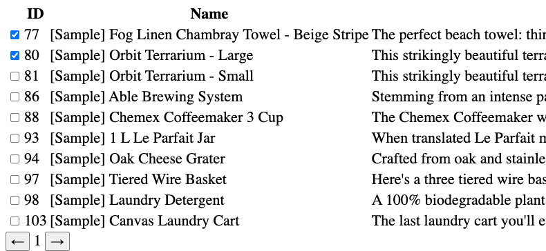
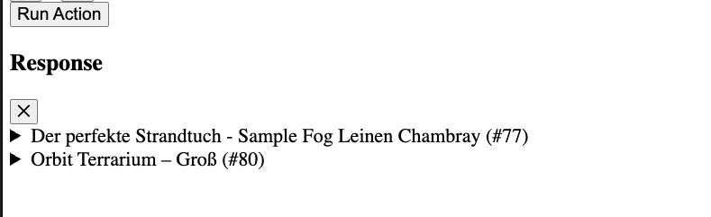

# 🌍 Multi-Lang-Overrides-AI – BigCommerce Product Localization Tool

A modular Python-based tool designed to **fetch, generate, translate, and update localized product data** in **BigCommerce** stores via GraphQL - based on this latest feature: [International Enhancements for Multi-Storefront](https://developer.bigcommerce.com/docs/store-operations/catalog/msf-international-enhancements/overview). Supports custom overrides for `name` and `description` (can be extended), integrates with **Vertex AI**, and is deployable via Docker or Cloud Build.
*Localization setup is only allowed when Catalyst is enabled
---

## 🚀 Features

- ✅ Fetch product data across multiple locales
- ✅ Update localized overrides for name/description
- ✅ Generate new product descriptions using Vertex AI (optional)
- ✅ REST-like API entrypoints using FastAPI-style modules (e.g., `generate.py`, `products.py`)
- ✅ Works with BigCommerce's GraphQL API
- ✅ Container-ready via `Dockerfile` and `cloudbuild.yaml`

---

## 🧱 Project Structure

```
Multi-Lang-Overrides-Ai/
├── Dockerfile                     # Container setup
├── cloudbuid.yaml                 # GCP Cloud Build config
├── main.py                        # CLI / server entry point
├── requirements.txt
├── templates/                     # HTML templates for frontend
│   └── index.html
├── static/                        # Static assets
├── src/
│   ├── config.py                  # Env var configuration
│   ├── api/                       # Modular endpoints (generate, locales, products)
│   ├── client/                    # API clients (BigCommerce, Vertex)
│   ├── queries/                   # GraphQL queries for all mutations and gets
│   ├── operations/               # Business logic per module
│   ├── services/                 # Core services (product updates, query processors)
│   └── utils/                    # Contains a custom logger that allows for debug mode
```

---

## ⚙️ Setup & Configuration

### 1. Install dependencies

```bash
python3 -m venv .venv
source .venv/bin/activate
pip install -r requirements.txt
```

### 2. Configure Environment

Set environment variables directly or via `.env`:

```bash
export BC_ACCESS_TOKEN=your_token
export BC_STORE_HASH=your_store_hash
export CLIENT_ID=your_client_id
export CLIENT_SECRET=your_client_secret
export BC_CHANNEL_ID=1700121
export VERTEX_API_KEY=your_vertex_key
export VERTEX_MODEL_ID="gemini-1.5-flash-8b"
```
Guide to issue [VERTEX_MODEL_ID](https://www.byteplus.com/en/topic/536737?title=how-to-get-api-key-for-vertex-ai-a-comprehensive-guide) in GCP  
Recommended Model: "gemini-1.5-flash-8b" - cheapest and fastest 
---
 
## ▶️ Running Locally

### Run Main CLI - Server App

```bash
python main.py
```

### FastAPI is being used to expose enpoints to the UI, can also be used via API direct call:
You can call endpoints in `../api/generate`, `../api/products`, `../api/products/locales` etc.
FastAPI provides a SWAGGER via `.../docs`

### UI interaction and elements

*Running UI mode: `.../ui`* on any browser

**1. 	Action Buttons (Top-Level Controls)**  
These buttons define the type of action to be performed on the selected products.
 - Generate Overrides - Uses AI to create a Description and a Product name in the translated version by using the default product information. If nothing exists, no worries, it will do magic for you
 - View Overrides - Allows the user to view the overriden information of your products for a given locale
 - Manual Edit Override - Allow the user to manually input an override for either product name or description

**2. Locale Checkbox Selectors**  
Locales are dynamically populated based on the current channel defined in the .env file. You can select which locales will be affected by the action.
  
**3. Product List with Pagination**
This section displays a paginated list of products. You can select one or multiple products from the list to apply the selected action.   
  

**4. Run Action & Response Logs**  
Once the action is triggered, this section displays the execution responses for each product/locale combination.


---

## 🔧 Services Overview

### Product Localization Service (`product_multilang_service.py`)
- `get_localized_data(...)`
- `update_all_locales(...)`
- `delete_all_locales(...)`

### Vertex AI Integration (`vertex_operations.py`)
- Generate or translate multilingual product descriptions
- Prompt-based HTML output tailored to BigCommerce structure

### BigCommerce Client (`bc_client.py`)
- GraphQL and REST clients with retries, headers, and token handling
- Supports admin and storefront contexts

---

## 🧪 GraphQL Mutation Example (Working)

This project replicates and wraps this verified mutation:

```bash
curl --location 'https://api.bigcommerce.com/stores/STORE_HASH/graphql' \\
--header 'X-Auth-Token: YOUR_TOKEN' \\
--header 'Content-Type: application/json' \\
--data '{
  "query": "mutation SetProductBasicInformation($input: SetProductBasicInformationInput!, $channelId: ID!, $locale: String!) { product { setProductBasicInformation(input: $input) { product { id overridesForLocale(localeContext: { channelId: $channelId, locale: $locale }) { basicInformation { name description } } } } } }",
  "variables": {
    "input": {
      "productId": "bc/store/product/129",
      "localeContext": {
        "channelId": "bc/store/channel/1700121",
        "locale": "de"
      },
      "data": {
        "name": "Kartoffel",
        "description": "<p>Beschreibung...</p>"
      }
    },
    "channelId": "bc/store/channel/1700121",
    "locale": "de"
  }
}'
```

---

## 📦 Docker

Build and run the app with Docker:

```bash
docker build -t bc-multilang .
docker run -e BC_ACCESS_TOKEN=... -p 8000:8000 bc-multilang
```

---

## ☁️ Cloud Build 

Deploy using `cloudbuild.yaml` for GCP Cloud Run or similar environments.

---

## ✅ Completed Tasks

- [x] **Modularize API Endpoints**  
  Structured the project with clean, scalable route handling under `src/api/`.

- [x] **Create Flexible GraphQL Queries**  
  Built reusable, parameterized GQL queries and mutations to support multiple locales and product structures.

- [x] **Centralize Queries and Mutations**  
  Centralized all GQL logic under `src/queries/` to ensure single-source-of-truth for data operations.

- [x] **Implement Multi-Locale Override Updater**  
  Service now supports reading, writing, and deleting overrides for any number of locales.

- [x] **Optional Front-End for Manual Edits**  
  HTML interface stub created (under `templates/`) to enable manual input and review when needed.

---

## 🛠️ In Progress / Planned Improvements

- [ ] **Credential Flexibility**  
  Support dynamic credential loading (via UI or mounted config) to eliminate dependency on `.env` or hardcoded globals.

- [ ] **Promt Flexibility**  
  Support dynamic prompt update - empower merchants to have trailored descriptions for their products

- [ ] **Add AI Translation for Non-Multigeo Stores**  
  Support bulk translation + override updates for stores that don’t use built-in BigCommerce multi-geo locale features.

- [ ] **Support External AI Providers**  
  Pluggable architecture to allow content generation with:
  - [ ] OpenAI (GPT)
  - [ ] Vertex AI
  - [ ] Claude (Anthropic)
  - [ ] DeepSeek or others via config

- [ ] **Add hard-limiter to AI API calls **  
  We shouldn't allow merchants to mass bulk update whole catalogs -> External API is required after that

- [ ] **Improve UI/UX**  
  Replace the basic FLASK Unicorn UI with a modern React or Vue interface; the backend is fully decoupled and ready.

- [ ] **Search Integration (GQL-powered)**  
  Add UI+backend support for searching products using GQL filters.
  - [ ] Optional locale-aware search using `Accept-Language` header.

---

## 🪲 Bug  
- [ ] Improve Locale {base}-XX handling 

---

## Credits

Developed by [@JoseUgalde](https://github.com/JoseUgalde) using BigCommerce, Python, and AI. :) 

---

## 📄 License

MIT — Free for personal or commercial use.
